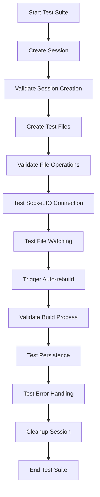

# Visual Editor Server Integration Test

## Overview

I've created a comprehensive integration test that validates the complete end-to-end functionality of the Visual Editor and Server integration. This test ensures that:

- ✅ **Session Management**: Creates and manages editor sessions
- ✅ **File Operations**: CRUD operations on files through the API
- ✅ **Real-time Communication**: Socket.IO file change notifications
- ✅ **Build System**: Auto-rebuild functionality and bundle generation
- ✅ **Data Persistence**: Session and file persistence across operations
- ✅ **Error Handling**: Graceful handling of invalid inputs and edge cases

## Test File Location

The comprehensive integration test is located at:
```
packages/visual-editor/__tests__/VisualEditorIntegration.test.ts
```

## Prerequisites

Before running the integration test, ensure:

### 1. Server is Running
```bash
# Start the server in a separate terminal
cd packages/server
npm start
```

### 2. Dependencies are Installed
```bash
# Install test dependencies
cd packages/visual-editor
npm install
```

The test requires these dependencies (already included):
- `axios` - For HTTP API calls (already in dependencies)
- `socket.io-client` - For real-time communication testing (already in dependencies) 
- `fs-extra` - For file system operations (already in dependencies)
- `@types/fs-extra` - TypeScript types (already in devDependencies)

## Running the Integration Test

### Quick Start
```bash
cd packages/visual-editor
npm run test:integration
```

### Alternative Ways to Run
```bash
# With Jest directly
npx jest --testPathPattern=VisualEditorIntegration.test.ts --verbose --testTimeout=30000

# With coverage
npx jest --testPathPattern=VisualEditorIntegration.test.ts --coverage --verbose

# Watch mode for development
npm run test:watch
```

## What the Test Validates

### 1. Session Management
- ✅ Creates new editor sessions via `/api/editor/init`
- ✅ Retrieves session information via `/api/editor/sessions`
- ✅ Validates session directory structure
- ✅ Confirms workspace files are copied correctly

### 2. File Operations
- ✅ Creates new files via `PUT /api/editor/session-file/{sessionId}/{filePath}`
- ✅ Reads file content via `GET /api/editor/session-file/{sessionId}/{filePath}`
- ✅ Updates existing files via `PUT /api/editor/session-file/{sessionId}/{filePath}`
- ✅ Validates file persistence in the filesystem

### 3. Real-time Communication
- ✅ Establishes Socket.IO connection to server
- ✅ Receives `file-changed` events when files are modified
- ✅ Validates event payload structure and content
- ✅ Tests real-time file change notifications

### 4. Build System Integration
- ✅ Triggers auto-rebuild when TypeScript/JavaScript files change
- ✅ Receives `rebuild-started` and `rebuild-completed` events
- ✅ Validates build success and failure scenarios
- ✅ Confirms compiled bundles are created in the correct location

### 5. Data Persistence
- ✅ Session data persists across multiple operations
- ✅ File changes remain after read/write operations
- ✅ Sessions can be retrieved from the filesystem

### 6. Error Handling
- ✅ Invalid session IDs return proper 404 errors
- ✅ Security validation prevents path traversal attacks
- ✅ Malformed requests return appropriate error responses

## Expected Output

When the test runs successfully, you should see output like:

```
Visual Editor Server Integration
  Session Management
    ✅ should create a new editor session successfully (2.5s)
    ✅ should retrieve session information (1.2s)
  File Operations
    ✅ should create and save a new file via editor API (1.8s)
    ✅ should read file content via editor API (0.9s)
    ✅ should update file content via editor API (1.1s)
  File Watching and Real-time Updates
    ✅ should receive file change events via Socket.IO (5.2s)
  Build System Integration
    ✅ should trigger auto-rebuild when files change (8.7s)
    ✅ should create compiled bundle files (2.1s)
  Session Persistence and Recovery
    ✅ should persist session data across server operations (1.5s)
  Error Handling and Edge Cases
    ✅ should handle invalid session IDs gracefully (0.8s)
    ✅ should handle invalid file paths gracefully (0.7s)
    ✅ should handle malformed requests gracefully (0.6s)

Test Suites: 1 passed, 1 total
Tests:       11 passed, 11 total
Time:        26.9s
```

## Test Architecture

The integration test follows this flow:



## Test Files Created and Cleaned Up

During testing, these temporary files are created and automatically cleaned up:

- `components/TestComponent.tsx` - Basic CRUD operations
- `components/FileWatchTest.tsx` - File watcher validation
- `screens/BuildTestScreen.tsx` - Auto-rebuild trigger
- `persistence/TestFile.tsx` - Persistence validation

## Troubleshooting

### Server Not Running
If you see:
```
❌ Server is not running. Please start the server first.
```

**Solution**: Start the server first:
```bash
cd packages/server && npm start
```

### Socket.IO Connection Issues
If real-time tests fail:
- Verify the server supports Socket.IO
- Check firewall settings for port 3001
- Ensure no other services are blocking the connection

### Build System Timeouts
If build tests timeout:
- The auto-rebuild system may be overloaded
- Try running the test with a single worker: `--maxWorkers=1`
- Increase the test timeout if needed

### Session Creation Failures
If session creation fails:
- Check file system permissions
- Ensure the `tmp/` directory is writable
- Verify no other editor instances are conflicting

## Integration with CI/CD

To use this test in continuous integration:

```yaml
name: Integration Tests
jobs:
  test:
    runs-on: ubuntu-latest
    steps:
      - uses: actions/checkout@v3
      - uses: actions/setup-node@v3
        with:
          node-version: '18'
      
      - name: Install Dependencies
        run: |
          cd packages/server && npm install
          cd packages/mobile && npm install
      
      - name: Start Server
        run: cd packages/server && npm start &
        
      - name: Wait for Server
        run: sleep 10
        
              - name: Run Integration Tests
        run: cd packages/visual-editor && npm run test:integration
        
      - name: Cleanup
        run: pkill -f "npm start" || true
```

## Architecture Validation

This integration test validates the key architectural components:

### Session Management (`SessionManager.js`)
- Session creation and lifecycle
- File system isolation
- Session persistence

### Auto-rebuild System (`AutoRebuildManager.js`)
- File change detection
- Debounced rebuild triggering
- Build event notifications

### File Operations (`visualEditor.js` routes)
- Secure file read/write operations
- Session-scoped file access
- Input validation and sanitization

### Real-time Communication (Socket.IO)
- File change event broadcasting
- Build status notifications
- Client-server synchronization

### Build System (`SessionBuilder.js`)
- Webpack compilation
- Bundle generation
- Build artifact management

## Key Benefits

This comprehensive integration test provides:

1. **Confidence**: Validates the complete editor-server workflow
2. **Regression Prevention**: Catches breaking changes early
3. **Documentation**: Serves as executable documentation of the system
4. **Quality Assurance**: Ensures all components work together properly
5. **Debugging Aid**: Helps identify issues in the integration layer

## Future Enhancements

Potential improvements to consider:

- **Performance Testing**: Add metrics for session creation and build times
- **Load Testing**: Test multiple concurrent sessions
- **Error Recovery**: Test system recovery after failures
- **Network Resilience**: Test behavior with network interruptions
- **Memory Usage**: Monitor memory consumption during operations

## Conclusion

The Visual Editor Integration Test provides comprehensive validation of the editor-server integration, ensuring that:

- Sessions are created and managed properly
- Files can be edited and saved reliably
- Real-time updates work correctly
- The build system functions as expected
- Error cases are handled gracefully

This test suite gives you confidence that the visual editor and server integration is working correctly and will continue to work as the system evolves.
