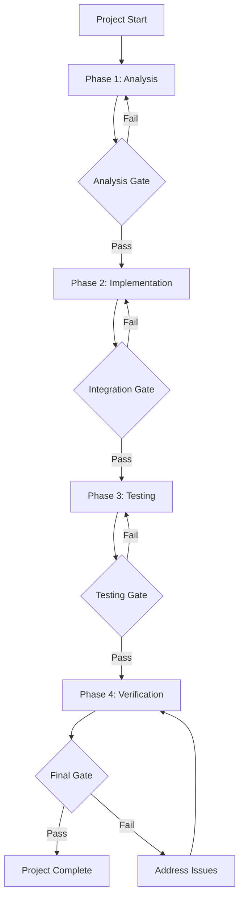

# React Native App Transformation Orchestration Project

## 🚀 **Quick Start**

```bash
# Make script executable (first time only)
chmod +x run-claude.sh

# Run multi-agent orchestration (recommended)
./run-claude.sh

# Or run single-agent fallback
./run-claude.sh single-agent
```

**The script will:**
1. Ask you what type of app you want to build
2. Deploy specialized sub-agents for analysis, design, implementation, and testing
3. Transform the branded44 app into your custom application
4. Ensure all quality gates pass before completion

---

## 🚨 **CLAUDE: START HERE - ASK THE USER THESE QUESTIONS FIRST!** 🚨

Do not proceed with any code transformation until you have collected the user's app requirements!

## 🤖 **STEP 1: Requirements Gathering (MANDATORY - Start Here)**

**Before beginning any transformation, I need to understand what app you want to build.**

### **📋 App Requirements Interview:**

**Please answer these questions to define your app:**

1. **What type of app do you want to build?**
   - Example: "Food tracking app", "Expense tracker", "Habit tracker", "Todo app", "Weather app", etc.

2. **What is the main purpose/goal of your app?**
   - Example: "Help users track their daily food intake and calories"

3. **What are the core features you want?**
   - List the 3-5 most important features
   - Example: "Add food items, track calories, view daily summary, set goals, history"

4. **What data will your app manage?**
   - Example: "Food items with calories, user daily intake, goals, history"

5. **Do you want any specific UI components or screens?**
   - Example: "Add item screen, dashboard, settings, history list"

6. **Any special requirements?**
   - Data persistence, offline support, notifications, etc.

**🚀 Once you provide these details, I'll transform the branded44 app accordingly!**

---

## Project Overview
Transform the existing Branded44 React Native app into a complete **[YOUR APP TYPE]** using an orchestrated approach with delegated sub-tasks. Follow established patterns, architecture, and coding standards while replacing core functionality.

## Orchestration Parameters
```bash
# Command line flags for orchestration mode
--mode=orchestration 
--project-type=react-native-transformation
--phases=analysis,implementation,testing,verification
--parallel-execution=true
--delegation-depth=2
--verification-gates=true
--app-type="[USER_DEFINED_APP_TYPE]"
--app-features="[USER_DEFINED_FEATURES]"
```

## Project Coordination Structure
**Project Manager**: Main orchestrator responsible for overall coordination
**Sub-Task Agents**: Specialized agents for specific implementation areas  
**Quality Gate Validators**: Verification specialists for each phase
**Requirements Manager**: Ensures user requirements are met throughout transformation

## App Transformation Requirements:

### **Core Changes:**
1. **Replace Home Screen** - Transform the main home screen into the new app interface
2. **Remove Templates Navigation** - Remove the templates section and navigation completely
3. **Keep Settings** - Maintain the settings screen for app preferences
4. **Use Sample Apps as Reference Only** - Study existing sample apps for patterns but don't modify them

### **New App Structure (Dynamic - Based on User Requirements):**
```
src/
  screens/
    HomeScreen/              // REPLACE: Transform into [USER_APP_NAME]Screen
      [USER_APP_NAME]Screen.tsx    // Main app screen (replaces current HomeScreen)
    SettingsScreen/          // KEEP: Maintain existing settings
  
  components/
    [PRIMARY_COMPONENT].tsx     // NEW: Main app component (based on user requirements)
    [SECONDARY_COMPONENT].tsx   // NEW: Secondary app component (feature-specific)
    [DATA_DISPLAY_COMPONENT].tsx // NEW: Data display/status component
    BottomNavigation.tsx        // UPDATE: Remove templates tab, keep Home/Settings
  
  context/
    [USER_APP_NAME]Context.tsx     // NEW: App state management
  
  types/
    [USER_APP_NAME]Types.ts        // NEW: TypeScript interfaces for user's data
  
  utils/
    [USER_APP_NAME]Logic.ts        // NEW: App logic utilities
  
  __tests__/
    [USER_APP_NAME]/               // NEW: Test files for app functionality
      [USER_APP_NAME]Context.test.tsx
      [USER_APP_NAME]Logic.test.tsx
      [USER_APP_NAME]Screen.test.tsx
```

**Note**: Component names and structure will be determined based on your app requirements provided in Step 1.

### **Integration Steps:**

#### **1. Study Existing Patterns (Reference Only):**
- **Examine existing sample apps** for:
  - Context management patterns (e.g., `CalculatorContext.tsx`)
  - Component structure and styling approaches
  - TypeScript interface patterns
  - Testing methodologies
  - Theme integration usage
- **DO NOT modify any existing sample apps** - use them only as reference

#### **2. Transform Core App Structure:**

**Update App.tsx:**
```typescript
// Remove TemplateIndexScreen import and usage
// Keep HomeScreen (transformed to [AppName]Screen) and SettingsScreen
// Update navigation to only have 'home' and 'settings' tabs
```

**Replace HomeScreen:**
```typescript
// Transform src/screens/HomeScreen into [AppName]Screen
// Follow same file structure and naming conventions
// Use theme system and responsive design patterns from existing code
```

**Update BottomNavigation:**
```typescript
// Remove 'templates' tab completely
// Keep only 'home' ([app name]) and 'settings' tabs
// Update icons and labels accordingly
```

#### **3. Implementation Guidelines:**

**Context Management:**
- Study existing context patterns in sample apps
- Create `[AppName]Context.tsx` following same reducer pattern
- Use `useReducer` for app state management
- Include AsyncStorage for data persistence if needed
- Export custom hook `use[AppName]()`

**Component Architecture:**
- Follow existing screen structure patterns for main app screen
- Use same `StyleSheet.create` pattern with theme integration
- Apply consistent responsive design calculations
- Maintain same prop interface and TypeScript patterns

**Styling Consistency:**
- Use existing `useTheme()` hook throughout
- Apply `theme.colors` for all styling
- Follow same responsive calculations (`Dimensions.get('window')`)
- Maintain visual consistency with existing app design

**State Structure Template (Will be customized based on your app):**
```typescript
interface [USER_APP_NAME]State {
  // Define app-specific state properties based on user requirements
  items: [USER_DATA_TYPE][];           // Main data items
  selectedItem: [USER_DATA_TYPE] | null;  // Currently selected item
  appStatus: 'loading' | 'ready' | 'error';  // App status
  filters: [USER_FILTER_TYPE];         // Any filtering/search state
  settings: [USER_SETTINGS_TYPE];      // User preferences
  // Additional properties based on user requirements
}

type [USER_APP_NAME]Action = 
  | { type: 'ADD_ITEM'; payload: [USER_DATA_TYPE] }
  | { type: 'UPDATE_ITEM'; payload: { id: string; data: Partial<[USER_DATA_TYPE]> } }
  | { type: 'DELETE_ITEM'; payload: string }
  | { type: 'SELECT_ITEM'; payload: [USER_DATA_TYPE] | null }
  | { type: 'SET_FILTER'; payload: [USER_FILTER_TYPE] }
  | { type: 'RESET_APP' }
  // Additional actions based on user requirements
```

**Note**: Data types and actions will be defined based on your specific app requirements.

#### **4. Testing Requirements (MANDATORY - Must Complete Before App Completion):**

**Test Creation Requirements:**
- Create comprehensive tests in `__tests__/[AppName]/`
- Follow existing test patterns and structure from sample apps
- Test context state management thoroughly with all actions
- Test app logic functions with edge cases and error scenarios
- Include integration tests for complete app workflows
- Test component rendering and user interactions
- Test async operations and state persistence

**Required Test Files (Dynamic based on your app):**
```
__tests__/[USER_APP_NAME]/
  [USER_APP_NAME]Context.test.tsx       // Context state management tests
  [USER_APP_NAME]Logic.test.tsx         // Business logic and utility tests
  [USER_APP_NAME]Screen.test.tsx        // Main screen component tests
  [PRIMARY_COMPONENT].test.tsx          // Primary component tests
  [SECONDARY_COMPONENT].test.tsx        // Secondary component tests
  [DATA_DISPLAY_COMPONENT].test.tsx     // Data display component tests
  Integration.test.tsx                  // End-to-end app flow tests
```

**Test Verification Process (MUST COMPLETE):**
1. **Write all tests** following existing patterns in the codebase
2. **Run test suite** and ensure 100% pass rate: `npm test`
3. **Verify test coverage** meets minimum 80% threshold
4. **Test edge cases** and error scenarios thoroughly
5. **Validate integration tests** cover complete user workflows
6. **Fix any failing tests** before declaring completion

**Test Standards:**
- Use existing test utilities and patterns from codebase
- Mock external dependencies appropriately
- Test both positive and negative scenarios
- Include async operation testing
- Test component props and state changes
- Verify proper cleanup and memory management

#### **5. File Updates Required:**

**Core App Files (Generic):**
- `src/App.tsx` - Remove templates, update navigation
- `src/screens/HomeScreen/HomeScreen.tsx` - Transform to [USER_APP_NAME]Screen
- `src/components/BottomNavigation.tsx` - Remove templates tab

**New App Files (Based on Requirements):**
- `src/context/[USER_APP_NAME]Context.tsx` - App state management
- `src/components/[PRIMARY_COMPONENT].tsx` - Main app component
- `src/components/[SECONDARY_COMPONENT].tsx` - Feature-specific component
- `src/components/[DATA_DISPLAY_COMPONENT].tsx` - Data display/status
- `src/types/[USER_APP_NAME]Types.ts` - TypeScript interfaces
- `src/utils/[USER_APP_NAME]Logic.ts` - App logic utilities

**Test Files:**
- `__tests__/[USER_APP_NAME]/` - Comprehensive test suite

## 🔄 **Dynamic Implementation Plan Generation**

**After you provide app requirements, I will:**

1. **Generate specific file names** based on your app type
2. **Create detailed component specifications** for your features
3. **Define exact data types and interfaces** for your data
4. **Plan the state management** for your specific use case
5. **Create tailored test scenarios** for your app functionality
6. **Generate implementation roadmap** with your specific requirements

### **Quality Standards:**
- **TypeScript**: Strict typing like existing codebase
- **Theme Integration**: Consistent use of theme system
- **Responsive Design**: Works on all device sizes
- **Testing**: High test coverage following existing patterns
- **Code Quality**: Same ESLint/Prettier standards
- **Performance**: Efficient renders and smooth animations

### **Completion Criteria (ALL MUST BE VERIFIED):**

**Before declaring the transformation complete, you MUST:**

1. **Code Implementation Complete:**
   - All required files created and properly implemented
   - Navigation updated to remove templates functionality
   - App functionality fully working in simulator/device

2. **Test Suite Complete and Passing:**
   - All test files written following existing patterns
   - Run `npm test` and achieve 100% pass rate
   - No failing, skipped, or broken tests
   - Test coverage meets minimum 80% threshold

3. **Integration Verification:**
   - App runs successfully with `npm run ios` or `npm run android`
   - All app features work correctly in simulator
   - No console errors or warnings
   - Navigation flows work properly

4. **Code Quality Verification:**
   - TypeScript compilation successful with no errors
   - ESLint/Prettier standards maintained
   - All imports and dependencies resolved
   - No unused code or dead imports

**Verification Commands to Run:**
```bash
# Test all functionality
npm test

# Check TypeScript compilation
npx tsc --noEmit

# Run linting
npm run lint

# Start app and verify functionality
npm run ios
# or
npm run android
```

**Only declare completion when ALL criteria above are verified and working.**

### **Orchestration Workflow & Task Delegation:**

## **Phase 1: Analysis & Architecture (Parallel Delegation)**

**Task Delegation:**
```yaml
codebase_analyzer_agent:
  tasks:
    - Analyze existing sample apps for patterns
    - Document current architecture and dependencies
    - Identify reusable components and utilities
  deliverables:
    - Architecture analysis report
    - Pattern documentation
    - Component inventory

architecture_designer_agent:
  tasks:
    - Design new app structure based on requirements
    - Plan state management architecture
    - Define component interfaces and data flow
  deliverables:
    - New app architecture specification
    - State management design
    - Component interaction diagrams
```

**Coordination Point**: Merge analysis results before proceeding to implementation

## **Phase 2: Implementation (Parallel Execution)**

**Task Delegation:**
```yaml
navigation_specialist_agent:
  tasks:
    - Update App.tsx navigation structure
    - Modify BottomNavigation component
    - Remove templates functionality
  deliverables:
    - Updated navigation components
    - Navigation flow documentation

ui_components_agent:
  tasks:
    - Implement primary app components
    - Create status/info display components
    - Apply theme integration
  deliverables:
    - All UI components
    - Component documentation
    - Theme integration

state_management_agent:
  tasks:
    - Implement app context and state management
    - Create utility functions and business logic
    - Add data persistence layer
  deliverables:
    - Context implementation
    - Utility functions
    - State management logic

screen_transformation_agent:
  tasks:
    - Transform HomeScreen to [AppName]Screen
    - Implement main app interface
    - Integrate all components
  deliverables:
    - Main app screen
    - Screen integration
    - User interface flows
```

**Coordination Point**: Integration testing and component compatibility validation

## **Phase 3: Testing (Critical Quality Gate)**

**Task Delegation:**
```yaml
unit_test_specialist_agent:
  tasks:
    - Write component unit tests
    - Test context state management
    - Test utility functions and business logic
  deliverables:
    - Complete unit test suite
    - Test coverage report
    - Component test documentation

integration_test_agent:
  tasks:
    - Write integration tests for complete workflows
    - Test navigation flows
    - Test data persistence and state management
  deliverables:
    - Integration test suite
    - Workflow test documentation
    - End-to-end test scenarios

test_validation_agent:
  tasks:
    - Run all tests and validate 100% pass rate
    - Verify test coverage meets 80% threshold
    - Fix any failing tests
  deliverables:
    - Test execution report
    - Coverage analysis
    - Quality assurance sign-off
```

**Coordination Point**: All tests must pass before proceeding to final verification

## **Phase 4: Verification & Quality Assurance**

**Task Delegation:**
```yaml
code_quality_validator_agent:
  tasks:
    - Run TypeScript compilation checks
    - Validate ESLint/Prettier standards
    - Check for unused imports and dead code
  deliverables:
    - Code quality report
    - Compilation validation
    - Standards compliance report

functionality_validator_agent:
  tasks:
    - Test app in iOS/Android simulator
    - Validate all features work correctly
    - Check for console errors and warnings
  deliverables:
    - Functionality test report
    - Simulator testing results
    - Performance validation

final_integration_validator_agent:
  tasks:
    - Run all verification commands
    - Validate complete app transformation
    - Confirm all requirements met
  deliverables:
    - Final validation report
    - Project completion certification
    - Deployment readiness confirmation
```

## **Orchestration Control Flow:**



**Coordination Rules:**
- No phase can start until previous phase passes its quality gate
- Parallel tasks within a phase must complete before phase coordination point
- Any task failure triggers phase rollback and issue resolution
- All verification commands must pass for project completion

## **Orchestration Execution Commands:**

```bash
# Start orchestrated transformation
claude --mode=orchestration \
       --project-type=react-native-transformation \
       --phases=analysis,implementation,testing,verification \
       --parallel-execution=true \
       --delegation-depth=2 \
       --verification-gates=true \
       --app-name="[AppName]" \
       --prompt-file="claude-code-prompt.md"

# Monitor orchestration progress
claude --status --project-id=[generated-id]

# Force quality gate validation
claude --validate-gate --phase=[current-phase] --project-id=[generated-id]

# Override failed gate (use with caution)
claude --override-gate --phase=[failed-phase] --reason="[justification]"
```

## **Coordination & Communication Protocol:**

**Inter-Agent Communication:**
```yaml
message_types:
  - task_assignment
  - task_completion
  - coordination_request
  - quality_gate_result
  - issue_escalation

coordination_events:
  - phase_start
  - task_completion
  - gate_validation
  - issue_detection
  - project_completion

escalation_triggers:
  - task_failure_threshold: 3
  - gate_failure_count: 2
  - critical_dependency_block: true
```

**Progress Tracking:**
- Real-time task status dashboard
- Inter-phase dependency tracking
- Quality gate status monitoring
- Resource allocation optimization

### **Key Focus Areas (Orchestrated Approach):**
1. **Coordinated Task Execution** - Parallel agent work with proper synchronization
2. **Quality Gate Enforcement** - Strict validation at each phase transition
3. **Dependency Management** - Ensure proper task sequencing and handoffs
4. **Continuous Integration** - Real-time validation and integration testing
5. **Automated Verification** - Systematic validation of all deliverables
6. **Risk Mitigation** - Early detection and resolution of issues
7. **Resource Optimization** - Efficient allocation of agent capabilities

## **Fallback Execution Modes:**

**If orchestration is not available, fall back to sequential mode:**

```bash
# Single-agent mode (fallback)
claude --mode=sequential \
       --task-breakdown=true \
       --verification-checkpoints=true \
       --prompt-file="claude-code-prompt.md"
```

**Sequential Workflow (Non-Orchestrated):**
1. Execute Phase 1 tasks sequentially with checkpoint validation
2. Manual coordination points between phases
3. Single-agent responsibility for all tasks
4. Increased execution time but same quality standards

**Hybrid Mode (Partial Orchestration):**
```bash
# Limited delegation with manual coordination
claude --mode=hybrid \
       --max-agents=2 \
       --coordination=manual \
       --phases=implementation,testing
```

## **Environment Requirements:**

**For Full Orchestration:**
- Multi-agent capable environment
- Task delegation framework
- Inter-agent communication system
- Quality gate automation
- Progress monitoring dashboard

**For Fallback Modes:**
- Standard Claude environment
- Manual checkpoint validation
- Sequential task execution
- Manual quality assurance

### **Final App Structure (Generic Template):**
- **Home Tab**: Complete new app interface based on user requirements
- **Settings Tab**: App preferences and settings (maintained)
- **No Templates**: Clean, focused app experience
- **Custom Features**: Implements user-specified functionality
- **Quality Assured**: Comprehensive testing and validation
- **Orchestration Ready**: Designed for parallel development when available

## 🎯 **Execution Strategy:**

### **Phase 0: Requirements Collection (START HERE)**
1. **Ask user for app requirements** using the interview questions above
2. **Generate specific implementation plan** based on their answers
3. **Create tailored file structure** for their app type
4. **Define custom data types and components** for their needs

### **Phase 1-4: Implementation (After Requirements)**
1. **Attempt orchestrated mode first** for maximum efficiency
2. **Fall back to sequential mode** if orchestration unavailable
3. **Maintain same quality standards** regardless of execution mode
4. **Use task delegation patterns** even in single-agent mode
5. **Implement verification gates** at all coordination points

## ⚠️ **IMPORTANT: Always start by asking the user what app they want to build!**

Study the existing sample apps thoroughly for patterns, then implement a clean focused app that replaces the current template-focused functionality while maintaining the same high code quality and architectural consistency through orchestrated or sequential execution. 